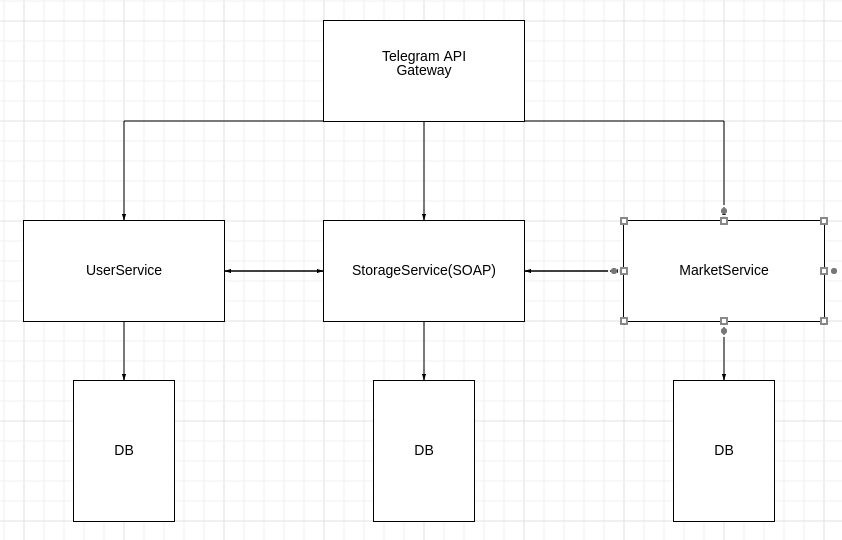

# Mega market bot
Магазин телеграмм бот

###  Схема и описание микросервисов   

   
- Gateway(Telegram API) - Микросервис для взаимодействия с телеграммом и запрос на другие микросервисы для получения результата. 
Взаимодействует со всеми микросервисами.
- UserService - Для хранения сведений о ролях пользователей и запросов на получение роли. Взаимодействует с StorageService, 
например для удаления товаров, если пользователь перестал быть продацом.
- StorageService - Для хранения сведений о товарах и изменения их количества. Взаимодействует с UserService, например для проверки 
прав пользователя.
- MarketService - Для хранения и изменения сведений о заказах, оплате, и корзине пользователя. Взаимодействует с StorageService, например
для списания товаров в случае покупки.

Разработчикам ознакомится с файлом [rules.txt](https://github.com/sergey-oreshkin/megamarket-bot/blob/develop/rules.txt)

#### Команды общие  
- /list - список всех товаров
- /buy (id) - добавить товар с данным идентификатором в корзину
- /cart - посмотреть свою корзину
- /pay - оплатить корзину
- /clear - очистить корзину
- /requestadmin - запрос на получение роли админ
- /requestseller - запрос на получение роли продавец

#### Команды продавца
- /inventory - список товаров текущего продавца
- /add (name count) - добавить себе на склад товар `name` в количестве `count`
- /remove (name count) - убрать у себя со склада товар `name` в количестве `count`

#### Команды админа
- /all - список всех пользователей с правами админа или продавца
- /requests - список всех заявок на роль админа или продавца
- /set (username role) - установить пользователю с именем `username` роль `role`. Если роль не указана - удалить все роли у данного пользователя.
- /inventory (username) - список товаров продавца с именем `username`